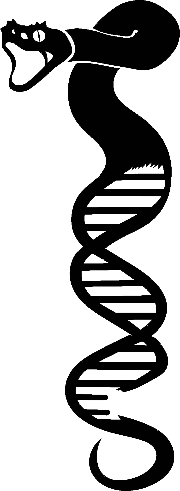
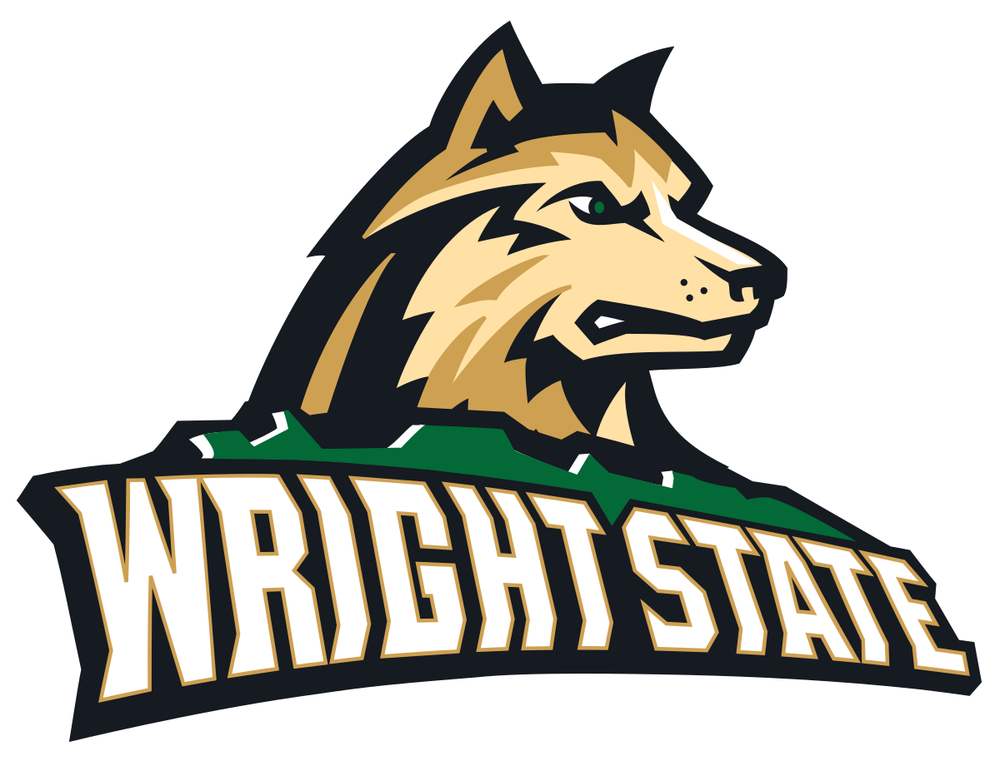
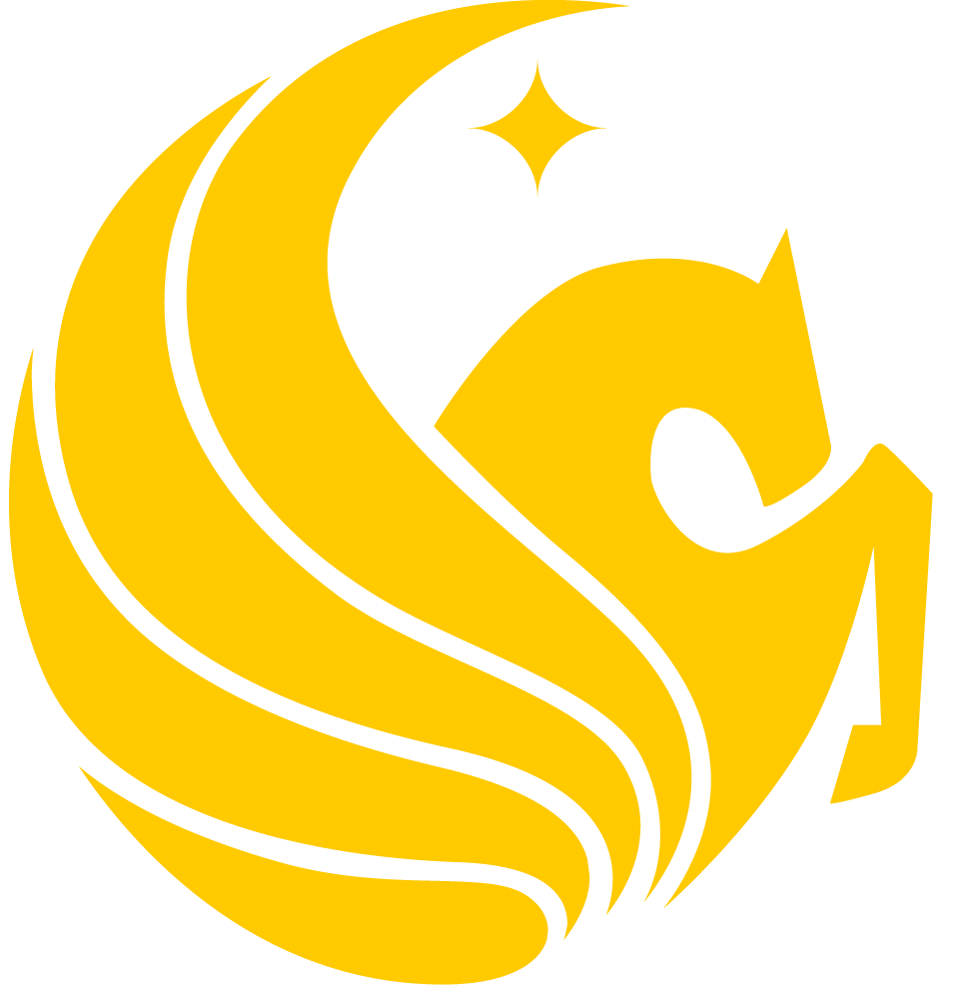
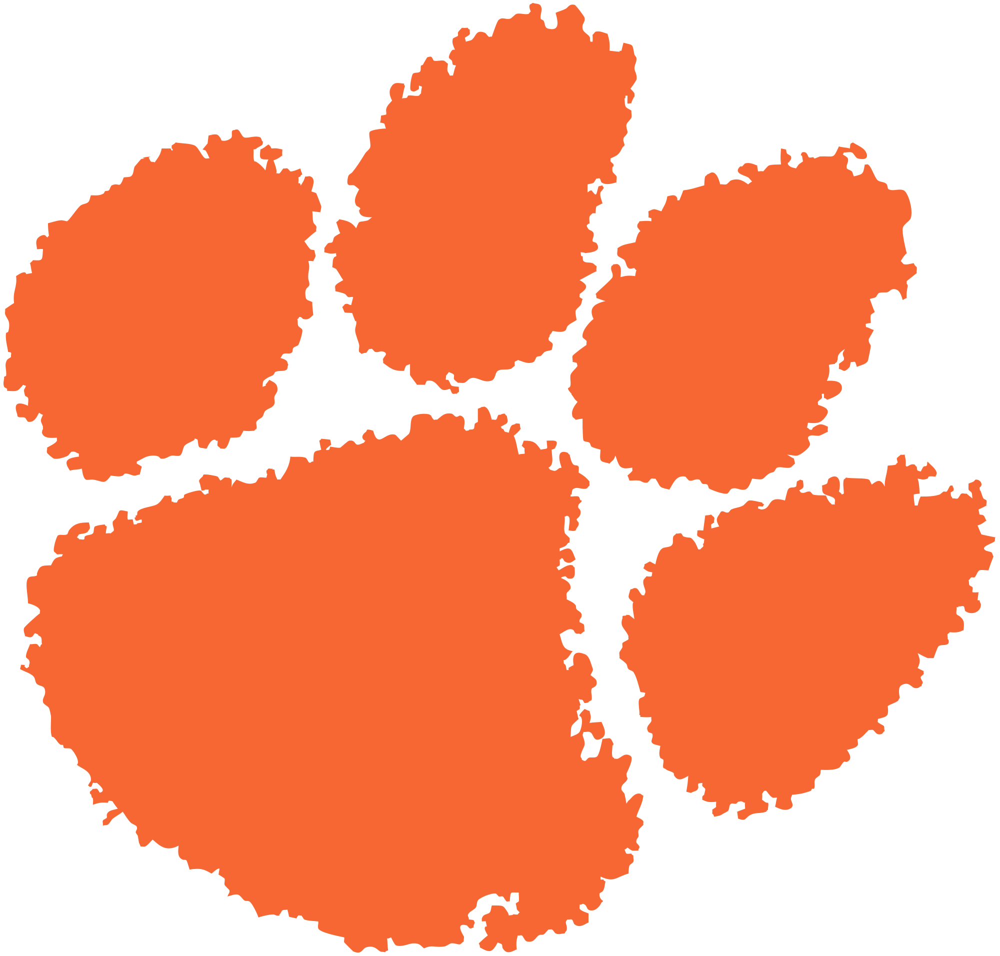
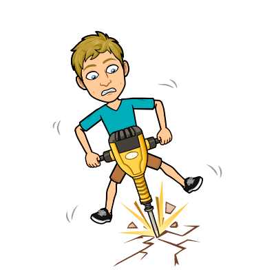

# Rhett M. Rautsaw, Ph.D.
### he/him/his
### Evolution | Ecology | Conservation
### Genomics | Bioinformatics
<table width="40%">
	<tr>
		<td width="25%"></td>
		<td width="25%"></td>
		<td width="25%"></td>
		<td width="25%"></td>
	</tr>
</table>

## Welcome to my GitHub Page!
I am searching for a remote bioinformatics position!

# Who am I?

<table width="75%">
	<tr>
		<td width="20%"></td>
		<td width="20%"></td>
		<td width="20%"></td>
		<td width="20%"></td>
		<td width="20%"></td>
	</tr>
	<tr>
		<td width="20%">B.S.   2012-2014</td>
		<td width="20%">M.S.   2014-2017</td>
		<td width="20%">Ph.D.   2017-2022</td>
		<td width="20%">Postdoc   2022-</td>
		<td width="20%">Postdoc   2022-</td>
	</tr>
</table>

Generally I am interested developing and using tools that transform complex genomic data into biological knowledge. I consider myself an integrative/computational biologist with interests spanning the intersection of evolution, ecology, genomics, and conservation. Specifically, I use high-throughput sequencing methods and bioinformatics to understand (1) how ecology and changes in the genome impact the evolution of traits and (2) how genetic and trait diversity can impact our conservation decisions. For my Ph.D., I used hundreds of high-throughput sequencing samples to study the phylogenomics of vipers 🐍 and role of competition on the evolution of their venom. While at USF/WSU for my postdoc, I will be working on Tasmanian Devil Facial Tumor Disease genomics; examining how the tumor has evolved since its divergence from the parental Tasmanian Devil genome.

## Experience
I have 8+ years of experience in bioinformatics, statistics, scripting/programming, software engineering, pipeline development, application development, high-throughput sequencing data analysis, and scientific communication. I have experience in a variety of -omic methodolgies including Illumina short-read transcriptomics (RNA-Seq), ATAC-Sequencing, Whole-Genome Bisulfite-Sequencing (Methylation Sequencing), and PacBio SMRT HiFi Sequencing.

## What am I learning now?
- Deep Learning
- Docker
- Snakemake
- C++
- HTML/Javascript

# Repositories
Below you will find a list of the repositories, tutorials, workshops, scripts, and applications I have developed...and yes I have way too much fun making GitHub repositories.

## Under Construction!

## Tutorials/Workshops

- [Bioinformatics]()
- 

## Pipelines

## Scripts

## Shiny Apps
I have a Digital Ocean Server on which I host several Shiny Apps ([RhettRautsaw.app](RhettRautsaw.app))

- [VenomMaps]()
- [MitoSIS]()
- [Sequencing Estimator]()
- [Coordinate Mapper]()

<!--
**RhettRautsaw/RhettRautsaw** is a ✨ _special_ ✨ repository because its `README.md` (this file) appears on your GitHub profile.

Here are some ideas to get you started:

- 🔭 I’m currently working on ...
- 🌱 I’m currently learning ...
- 👯 I’m looking to collaborate on ...
- 🤔 I’m looking for help with ...
- 💬 Ask me about ...
- 📫 How to reach me: ...
- 😄 Pronouns: ...
- ⚡ Fun fact: ...
-->
